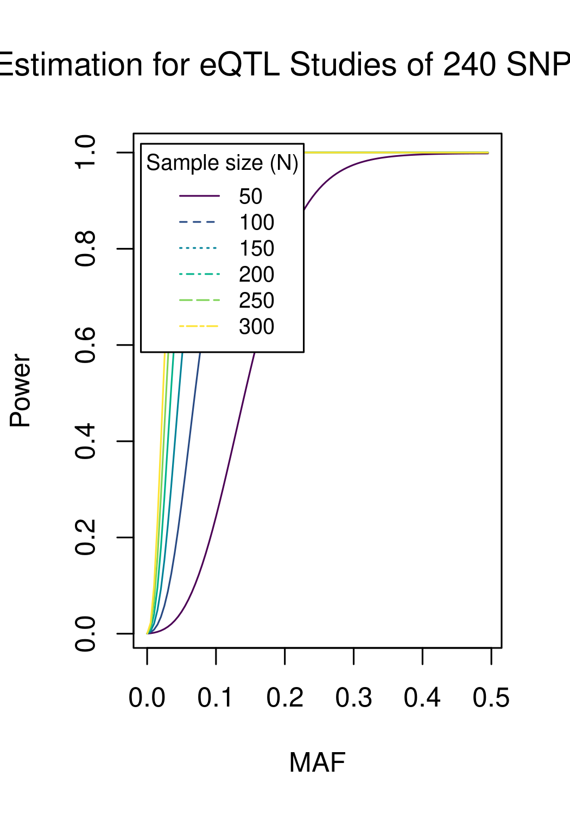

## Power of eQTL studies

This is according to [eQTL.R](eQTL/eQTL.R).

## Omics projects of several traits

Seeding comprehensive analysis in their named directories (e.g., [BMI](BMI)), the repository links to technical issues documented in [physalia](https://github.com/jinghuazhao/physalia), [Mixed-Models](https://github.com/jinghuazhao/Mixed-Models), [software-notes](https://github.com/jinghuazhao/software-notes) and other sister repositories: 
[SUMSTATS](https://github.com/jinghuazhao/SUMSTATS),
[FM-pipeline](https://github.com/jinghuazhao/FM-pipeline),
[PW-pipeline](https://github.com/jinghuazhao/PW-pipeline),
[hess-pipeline](https://github.com/jinghuazhao/hess-pipeline),
[TWAS-pipeline](https://github.com/jinghuazhao/TWAS-pipeline),
[EWAS-fusion](https://github.com/jinghuazhao/EWAS-fusion).
for fine-mapping, pathway analysis, TWAS, Mendelian randomisation, predictive analytics and other topics as highlighted in the [wiki page](https://github.com/jinghuazhao/Omics-analysis/wiki).

Earlier or broader aspects have been reflected in the following repositories: [Haplotype-Analysis](https://github.com/jinghuazhao/Haplotype-Analysis), [misc](https://github.com/jinghuazhao/misc), [R](https://github.com/jinghuazhao/R).

## Gene annotation

```r
library(biomaRt)
ensembl <- useMart("ensembl", dataset="hsapiens_gene_ensembl", host="grch37.ensembl.org", path="/biomart/martservice")
attr <- listAttributes(ensembl)
filter <- listFilters(ensembl)
gene <- getBM(attributes = c('ensembl_gene_id', 'chromosome_name', 'start_position', 'end_position', 'description', 'hgnc_symbol'), mart = ensembl)
```

## External links, UKBiobank

* [AMS](http://amsportal.ukbiobank.ac.uk/), https://www.ukbiobank.ac.uk/wp-content/uploads/2019/09/Access_019-Access-Management-System-User-Guide-V4.0.pdf
* Accessing data guide, http://biobank.ctsu.ox.ac.uk/crystal/exinfo.cgi?src=AccessingData
* Imputation, http://biobank.ctsu.ox.ac.uk/crystal/crystal/docs/impute_ukb_v1.pdf
* GWAS sumstats ([dropbox](http://www.nealelab.is/blog/2019/9/16/biomarkers-gwas-results0), http://www.nealelab.is/uk-biobank and GitHub, https://github.com/Nealelab/UK_Biobank_GWAS 
* [Institute of Translational Genomics](https://github.com/hmgu-itg).
